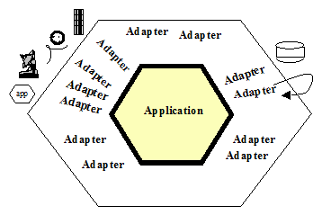
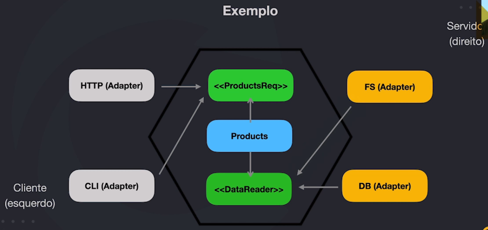

# Arquitetura Hexagonal / Ports and Adapters
---

- Complexidade de Negócio
- Complexidade Técnica

### Pontos importantes sobre arquitetura
- Crescimento sustentável: Melhora continua de forma saudável e tranquila
- Software precisa se pagar ao passar do tempo
- Software deve ser desenhado por você e não pelo seu framework
- Peças precisam se encaixar e eventualmente substituidas

### Lembre-se
Arquitetura diz respeito com o futuro do seu software.
CRUD qualquer um faz!

### Ciclo de vida de muitos projetos
Fase 1 | Fase 2 | Fase 3 |
---|---|---
Banco de dados        | Regras de negócio   |Mais acessos
Cadastros             | Criação de APIs     |Upgrades hardware
Validações            | Consumo de APIs     |Cache
Controllers           | Autorização         |API parceiros
Views                 | Relatórios          |Regras parceiros
Autenticação          | Logs                |Relatórios
Upload de arquivos    | &nbsp;              |&nbsp;

Fase 4 | Fase 5 | Fase 6 |
---|---|---
Mais acessos          |Escala Horizontal   |GraphQL
Upgrade hardware      |Sessões             |Bugs constantes
BD relatórios         |Uploads             |Logs?
Comandos              |Refatoração         |Integração CRM
V2 da API             |Autoscaling         |Migração para React
&nbsp;                |CI/DC               |&nbsp;

Fase 7 | Fase 8 | Fase 9 | Fase 10
---|---|---| ---
Inconsistência CRM    |Microsserviços          |Kubernetes          |Use a imaginação
Containers            |DB compartilhado        |CI/CD               |&nbsp;
CI/CD                 |Problemas com tracing   |Mensageria          |&nbsp;
Memórias              |Lentidão                |Perda de mensagens  |&nbsp;
Logs                  |Custo elevado           |Consultorias        |&nbsp;
Se livrar do legado   |&nbsp;                  |&nbsp;              |&nbsp;

### Principais problemas
- Não ter visão de futuro
- Não ter limites bem definidos
- Não pensar na possibilidade de troca e edição de componentes
- Não pensar em Escala
- Não pensar que precisa ter otimizações frequentes
- Não pensar na necessidade de mudanças bruscas

### Reflexões
- Está sendo doloroso para o desenvolvedor?
- Poderia ter sido evitado?
- Software está se pagando?
- Será que a relação com o cliente está boa?
- Cliente terá prejuizo com a brusca mudança arquitetural?
- Em qual momento tudo se perdeu?
- Se você fosse novo na equipe, você julgaria os devs que fizeram tudo isso?

### Arquitetura vs Design
"Atividades relacionadas a arquitetura de software são sempre de design. Entretanto, nem todas atividades de design são sobre arquitetura. O objetivo primário da arquitetura de software é garantir que os atributos de qualidade, restrições de alto nível e os objetivos do negócio,  sejam atendidos pelo sistema. Qualquer decisão de design que não tenha relação com este objetivo não é arquitetural. Todas as decisões de design para um componente que não sejam visíveis fora dele, geralmente, também não são."
*Fonte: Elemar Jr.*

### Arquitetura Hexagonal ou "Ports and Adapter"
"Allow an application to equally be driven by users, programs, automated test or batch scripts, and to be developed and tested in isolation from its eventual run-time devices and databases."
*Cockburn*

### Opinião (Wesley Willians)
O termo "Arquitetura" Hexagonal está muito mais ligado com decisões de design de software do que necessariamente de arquitetura.

- Definição de limites e proteção nas regras da aplicação
- Componentização e desacoplamento
    - Logs
    - Cache
    - Upload
    - Banco de dados
    - Comandos
    - Filas
    - HTTP / APIs / GraphQL
- Facilidade na quebra para microsserviços

### Lógica básica

### Exemplo 1

### Exemplo 2

### Dependency Inversion Principle
- Módulos de alto nível não devem depender de módulos de baixo nível. Ambos devem depender de abstrações
- Abstrações não devem depender de detalhes. Detalhes devem depender de abstrações

### Observações
- Não há padrão estabelecido de como o código deve ser organizado.
- Quanto mais desacoplado for o seu código, melhor.

### Links úteis para esse capítulo
Trabalhe com Docker para setar seu ambiente com mais facilidade:
https://gist.github.com/wesleywillians/73b275126b8d1562e32d7c3ac129784a

Vídeos auxiliares sobre Golang:
[Entenda mais sobre *ponteiros na Golang](https://www.youtube.com/watch?v=-FiBp1OeZF0)